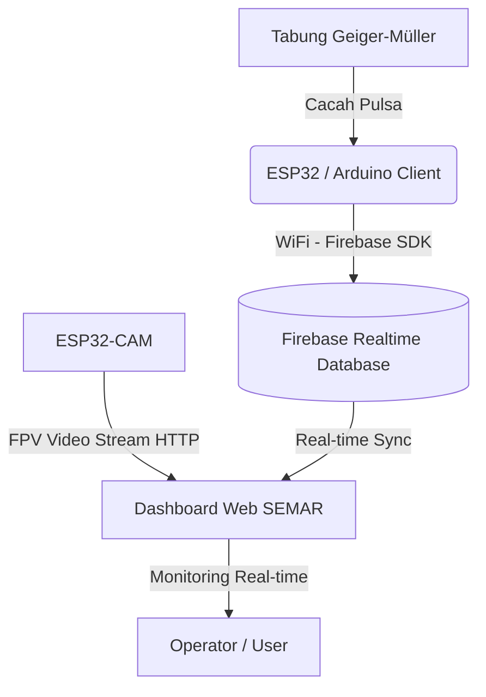

# 📡 SEMAR - Sarana Edukasi Monitoring Alam & Radiasi

<div align="center">
  
  
  <p><strong>Sistem Pemantauan Radiasi Lingkungan & FPV Streaming berbasis Internet of Things (IoT) dan Robotika Cerdas</strong></p>

  [](https://www.espressif.com/)
  [](https://firebase.google.com/)
  [](https://developer.mozilla.org/)
  [](LICENSE)
</div>

---

## 📖 Tentang SEMAR

**SEMAR (Sarana Edukasi Monitoring Alam & Radiasi)** adalah inovasi sistem robotik cerdas berbasis Internet of Things (IoT) yang dirancang untuk merevolusi cara memantau lingkungan radiasi. Alat ini hadir sebagai solusi keselamatan mutakhir yang memungkinkan pengukuran paparan radiasi dilakukan secara presisi dari jarak jauh menggunakan robot pengendali nirkabel bernama **CARLINS**. Hal ini memastikan keamanan operator sekaligus menjadi sarana edukasi interaktif.

---

## 🚀 Fitur Utama

- 🎯 **Presisi Tinggi**: Menggunakan detektor tabung **Geiger-Müller** untuk mendeteksi dan mengukur laju cacah (**CPS** / **CPM**) serta dosis radiasi secara instan (**µSv/h**).
- 🎥 **FPV Video Streaming**: Integrasi modul kamera nirkabel **ESP32-CAM** yang terpasang pada robot, memberikan umpan video langsung (real-time) dengan latensi rendah.
- ☁️ **Konektivitas Cloud IoT**: Sinkronisasi data sensor secara real-time ke **Firebase Realtime Database** untuk ditampilkan ke Dashboard Web dari mana saja.
- 🚨 **Sistem Peringatan Dini (Early Warning)**: Indikator status keselamatan otomatis (**Aman**, **Waspada**, **Bahaya**) disertai alarm Buzzer fisik dan visual di dashboard web apabila tingkat radiasi melewati ambang batas.
- 📊 **Visualisasi Data Dinamis**: Grafik real-time interaktif menggunakan **Chart.js** lengkap dengan fitur ekspor riwayat data ke format Excel secara instan.

---

## 🛠️ Arsitektur Sistem



---

## 📁 Struktur Repositori

Proyek ini terbagi menjadi 3 komponen utama:

| Direktori / File | Deskripsi |
| :--- | :--- |
| 📂 **[WEB_PKM](file:///D:/PKM/WEB_PKM)** | Kode Arduino/ESP32 utama untuk membaca sensor Geiger-Müller dan mengirim telemetri ke Firebase. |
| 📂 **[CameraWebServer](file:///D:/PKM/CameraWebServer)** | Kode firmware ESP32-CAM untuk mengaktifkan video streaming server lokal. |
| 📂 **[PROJECT ROBOT](file:///D:/PKM/PROJECT ROBOT)** | Dashboard web monitoring interaktif berbasis HTML, CSS (Glassmorphism), JS, dan Firebase SDK. |
| 📄 **[esp32-monitoring-web.ini](file:///D:/PKM/esp32-monitoring-web.ini)** | File konfigurasi environment / konfigurasi proyek. |

---

## ⚙️ Petunjuk Penggunaan & Instalasi

### 1. Unit Robot & Sensor (`WEB_PKM`)
- Buka file [WEB_PKM.ino](file:///D:/PKM/WEB_PKM/WEB_PKM.ino) menggunakan Arduino IDE atau VS Code (PlatformIO).
- Pasang library dependency yang dibutuhkan:
  - `Firebase ESP Client` (oleh FirebaseExtended)
  - Library WiFi & ESP32 core
- Konfigurasikan kredensial WiFi dan URL Firebase Database Anda pada kode program.
- Lakukan *upload* ke Board ESP32 unit robot Anda.

### 2. Kamera Nirkabel (`CameraWebServer`)
- Buka folder [CameraWebServer](file:///D:/PKM/CameraWebServer).
- Hubungkan board **ESP32-CAM** ke downloader board/FTDI adapter.
- Konfigurasi tipe modul kamera yang sesuai pada file [camera.ino](file:///D:/PKM/CameraWebServer/camera.ino) (contoh: `#define CAMERA_MODEL_AI_THINKER`).
- Lakukan *upload* program. Setelah sukses, ESP32-CAM akan memancarkan server streaming pada IP lokal tertentu (misalnya `http://172.20.10.3:81/stream`).

### 3. Dashboard Web (`PROJECT ROBOT`)
- Masuk ke folder [PROJECT ROBOT](file:///D:/PKM/PROJECT ROBOT).
- Buka file [index.html](file:///D:/PKM/PROJECT ROBOT/index.html) langsung di browser Anda, atau hosting menggunakan Firebase Hosting.
- Untuk mengkonfigurasi database Anda sendiri, perbarui konstanta `firebaseConfig` pada script di bagian akhir file [index.html](file:///D:/PKM/PROJECT%20ROBOT/index.html#L451-L459):
  ```javascript
  const firebaseConfig = {
      apiKey: "YOUR_API_KEY",
      authDomain: "YOUR_AUTH_DOMAIN",
      databaseURL: "YOUR_DATABASE_URL",
      projectId: "YOUR_PROJECT_ID",
      storageBucket: "YOUR_STORAGE_BUCKET",
      messagingSenderId: "YOUR_MESSAGING_SENDER_ID",
      appId: "YOUR_APP_ID"
  };
  ```

---

## 👥 Tim Pengembang (CARLINS - PKM THREE)

Sistem ini dikembangkan dengan dedikasi penuh oleh tim kami:

- **M. Setyo Danu Ismoyo**
- **Evita Rahmadani**
- **Theresa Anggreeni**
- **M. Gilang Satria M.**
- **Syahru Zaky Fadilah R.**
- **Blessia Tesalonika S.**
- **Azizi Maulidya Pasha**
- **M. Habibi Renaldy**
- **Sofia Atifah**
- **Farrelega Zhafran V. A.**
- **Agung Fransisco T.**
- **Bunga Nafisya Putri**

---

<div align="center">
  <p>Made with ❤️ by <strong>CARLINS Team</strong> for <strong>Program Kreativitas Mahasiswa (PKM)</strong></p>
</div>
